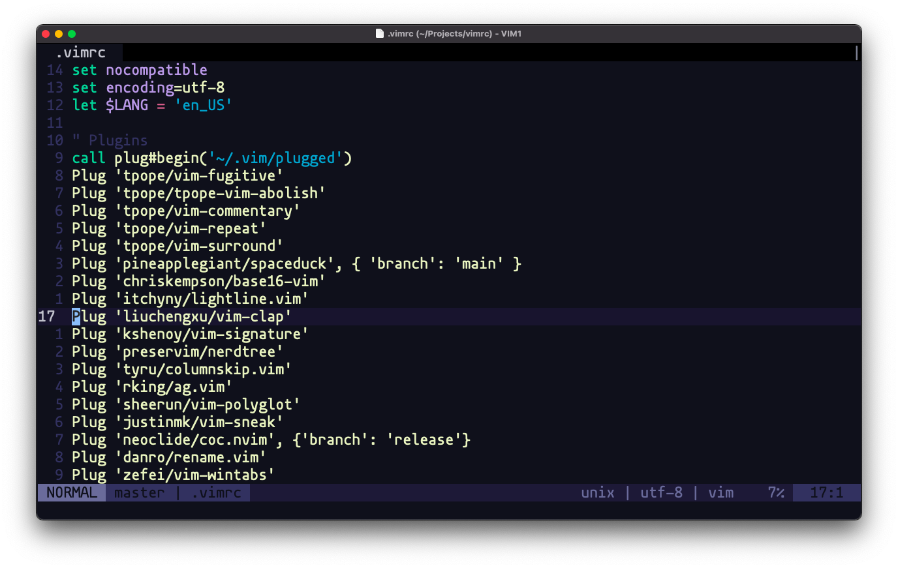

# .vimrc

## Installation

**curl**
```bash
curl -o - https://raw.githubusercontent.com/filipelinhares/vimrc/master/install.sh | sh
```
> Don't worry, it will back up your existing vim configuration.



## Fork and customize

1. :cyclone: Clone the repository
2. :pencil: Change the [folder name](https://github.com/filipelinhares/vimrc/blob/master/install.sh#L14)
3. :pencil: Change the [git endpoint](https://github.com/filipelinhares/vimrc/blob/master/install.sh#L18) to your repository
4. :smile: Have fun with your new `vimrc`

## License

[MIT](LICENSE.md) © Filipe Linhares
